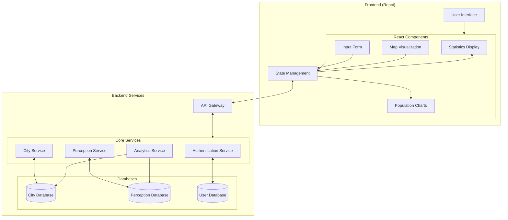

```mermaid
flowchart TB
subgraph Frontend["Frontend (React)"]
UI["User Interface"]
subgraph Components["React Components"]
MAP["Map Visualization"]
STATS["Statistics Display"]
FORM["Input Form"]
CHART["Population Charts"]
end
STATE["State Management"]
end

    subgraph Backend["Backend Services"]
        API["API Gateway"]

        subgraph Services["Core Services"]
            AUTH["Authentication Service"]
            CITY["City Service"]
            PERCEPTION["Perception Service"]
            ANALYTICS["Analytics Service"]
        end

        subgraph Database["Databases"]
            CITYDB[(City Database)]
            PERCEPTIONDB[(Perception Database)]
            USERDB[(User Database)]
        end
    end

    UI --> Components
    Components --> STATE
    STATE <--> API

    API <--> Services

    CITY <--> CITYDB
    PERCEPTION <--> PERCEPTIONDB
    AUTH <--> USERDB
    ANALYTICS --> PERCEPTIONDB
    ANALYTICS --> CITYDB

    %% Data flows
    FORM --> STATE
    MAP --> STATE
    STATE --> STATS
    STATE --> CHART
```
